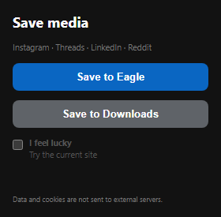

# Local Social Media Archiver

Save visual references from the web directly to [Eagle](https://eagle.cool/) or your Downloads folder — with your existing browser session, no account, and no external server.



## What it supports

- Instagram posts, carousels, and Reels
- LinkedIn images, carousels, and videos
- Reddit posts and media
- Any other site through **I feel lucky** — an opt-in, best-effort media collector
- Eagle import with the original post URL, a clean title, tags, and caption/description
- Local Downloads fallback with a `post.json` file

> **I feel lucky** requests permission only for the site currently open in your tab. It is intended for public, browser-accessible media and does not guarantee support for every website.

## Quick start

### Chrome extension

1. Download the latest `local-social-media-archiver-chrome.zip` from [Releases](../../releases), then unpack it.
2. Open `chrome://extensions` in Chrome and turn on **Developer mode**.
3. Click **Load unpacked** and select the unpacked folder.
4. Open a supported post, wait for its media to load, then click the extension icon.
5. Choose **Save to Eagle** or **Save to Downloads**.

For Instagram Reels and LinkedIn video, play the video for a few seconds before saving so the browser has loaded the media stream.

### Eagle Companion plugin

The companion is an onboarding and connection-check plugin. It does not receive or proxy browser data.

1. Download `local-social-media-archiver-eagle-companion.zip` from [Releases](../../releases).
2. Install it in Eagle using its plugin installation flow.
3. Open **Local Social Media Archiver** in Eagle and select **Test Eagle Connection**.

The Chrome extension saves directly to Eagle's local Web API at `localhost:41595` when Eagle is open.

## Privacy

- No user account, cloud processing, analytics, or external backend.
- Browser cookies and post content are not sent to a third-party service.
- Eagle integration is a local request to `http://localhost:41595` on the same computer.
- Supported sites may issue short-lived media URLs; importing or downloading promptly is recommended.

## Project structure

```text
chrome-extension/    Chrome Manifest V3 extension
eagle-companion/     Eagle Plugin Marketplace companion/onboarding plugin
docs/images/          README assets
```

## Development

Load `chrome-extension/` as an unpacked extension while developing. The Eagle companion can be installed from `eagle-companion/` in Eagle's developer plugin flow.

Before distributing the Eagle companion, set the public GitHub repository or Chrome Web Store URL in [`eagle-companion/js/config.js`](eagle-companion/js/config.js). This powers its **Install Chrome Extension** button.

## License

[MIT](LICENSE)
